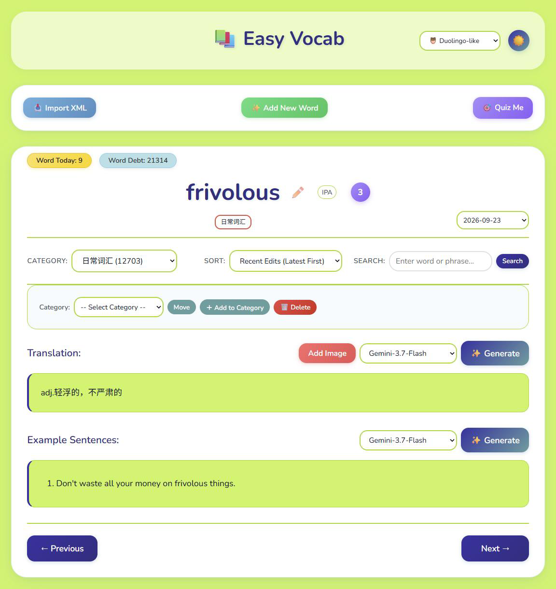
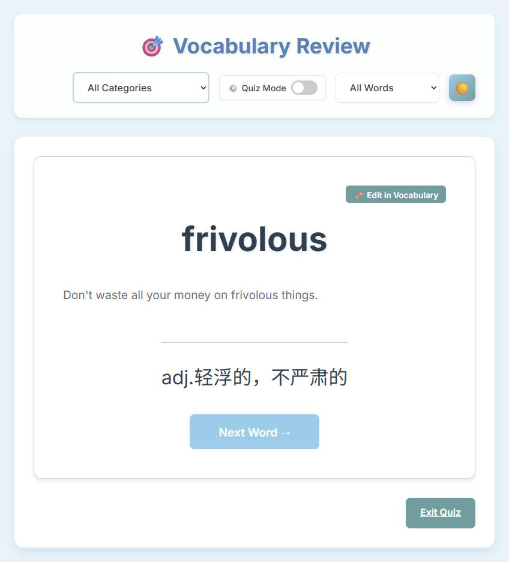
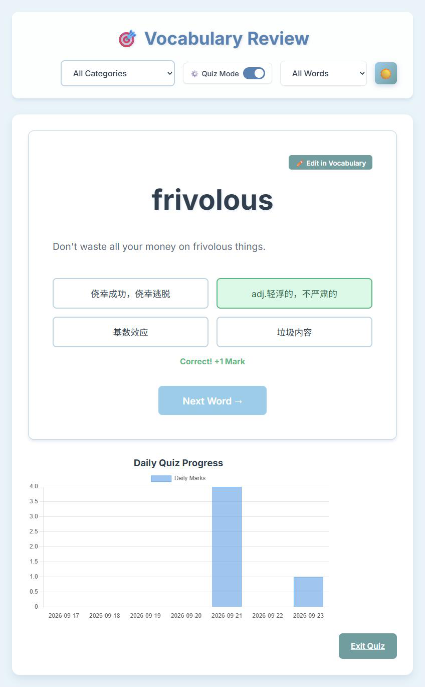
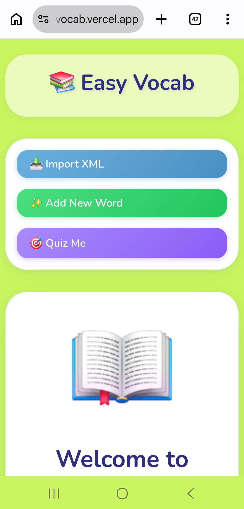
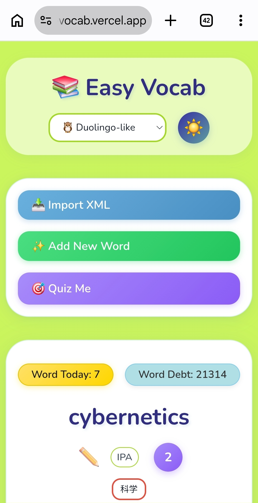
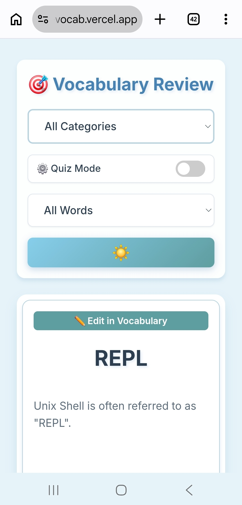

# EasyVocab - Vocabulary Learning App

**EasyVocab** is a personal vocabulary builder web app designed for English learners. It allows you to build your own vocabulary, review words and phrases in example sentences, and track your daily progress.


<p align="center">
  
</p>

## 🌟 Features

- **Cloud Hosted**: Deployed on Vercel with Aiven MySQL database for access anywhere
- **Secure Access**: Password-protected site with login rate limiting to prevent brute force attacks
- **AI-Powered Word Entry**: Auto-generate translations and example sentences with Google Gemini (Gemini 3.7 Flash by default)
- **Smart Quiz**: Spaced repetition based on the Ebbinghaus forgetting curve, with a flashcard mode, a multiple-choice mode, Image-only / IPA-only filters and a daily progress chart
- **Browse by Category**: Organize and review vocabulary by 20+ categories, and file a word under more than one category
- **Interactive Word Cards**: Word, translation, example sentences, IPA, an optional picture and the word's categories on one card
- **Daily Tracking**: "Word Today" and "Word Debt" counters, plus a per-word edit history
- **Keyboard Navigation**: Use left/right arrow keys to quickly navigate between words
- **In-Place Editing**: Edit translations and add sample sentences directly in the interface
- **XML Import**: Bulk import vocabulary from XML files with validation and duplicate handling
- **Performance Optimized**: Handles 30,000+ words efficiently with database indexing
- **Themes**: 5 GUI themes (Default, Minimalist, Cyberpunk, Glassmorphism, Duolingo-like) plus dark mode
- **Mobile Friendly**: Layout adapts to phones as well as desktop browsers

## 📸 Screenshots

### Quiz

<table>
  <tr>
    <td width="50%" valign="top"></td>
    <td width="50%" valign="top"></td>
  </tr>
  <tr>
    <td align="center"><sub>Flashcard mode</sub></td>
    <td align="center"><sub>Multiple-choice mode and daily progress chart</sub></td>
  </tr>
</table>

### Mobile

<table>
  <tr>
    <td width="33%" valign="top"></td>
    <td width="33%" valign="top"></td>
    <td width="33%" valign="top"></td>
  </tr>
  <tr>
    <td align="center"><sub>Welcome page</sub></td>
    <td align="center"><sub>Vocabulary page</sub></td>
    <td align="center"><sub>Quiz</sub></td>
  </tr>
</table>

## 📋 Prerequisites

Before you begin, ensure you have the following installed:

- **Python 3.8+**
- **MySQL 8.0+** 
- **Anaconda** 
- **Git** 

## 🚀 Installation & Setup

### Step 1: Install Python Dependencies

```bash
# Install required packages
pip install -r requirements.txt
```

### Step 2: Setup MySQL Database

1. **Open MySQL Workbench** and connect to your MySQL server

2. **Run the initialization script**:
   - Open the file `database/init_database.sql` in MySQL Workbench
   - Execute the entire script (this will create the database, tables, indexes, and stored procedures)

3. **Verify the setup**:
   ```sql
   USE bkdict_db;
   SHOW TABLES;
   -- Should show: words, categories, and category_stats view
   ```

### Step 3: Configure Environment Variables

1. **Copy the example environment file**:
   ```bash
   copy .env.example .env
   ```

2. **Edit `.env` file** with your MySQL credentials:
   ```env
   DB_HOST=localhost
   DB_PORT=3306
   DB_USER=root
   DB_NAME=bkdict_db
   DB_PASSWORD=your_mysql_password_here
      ```

## ▶️ Running the Application

### Start the Flask Server

```bash
# Make sure you're in the BKDict directory and conda environment is activated
python app.py
```

### Access the Application

Open your web browser and navigate to:
```
http://localhost:5001
```

## 📖 Usage Guide

### 1. Importing Vocabulary from XML Files

1. Click the **"Import XML File"** button in the control panel
2. Select your XML file (must follow the BKDict XML format)
3. Click **"Upload"** and wait for processing
4. You'll see a success message with import statistics

**XML Format Example**:
```xml
<wordbook>
  <item>
    <word>example</word>
    <trans><![CDATA[n. 例子；示例]]></trans>
    <tags>文化</tags>
  </item>
</wordbook>
```

### 2. Browsing Vocabulary

1. Select a category from the dropdown menu
2. The first word in that category will be displayed
3. Use the **← → arrow keys** or click **Previous/Next** buttons to navigate
4. The position indicator shows your current location (e.g., "Word 5 of 120")

### 3. Editing Translations

1. Click the **"Edit"** button next to the translation
2. Modify the text in the textarea
3. Click **"Save"** to update or **"Cancel"** to discard changes

### 4. Adding/Editing Sample Sentences

1. Click the **"Edit"** button next to "Sample Sentence"
2. Type or paste your example sentence
3. Click **"Save"** to store the sentence

### 5. Keyboard Shortcuts

- **← (Left Arrow)**: Go to previous word
- **→ (Right Arrow)**: Go to next word

## 🗂️ Project Structure

```
BKDict/
├── app.py                      # Main Flask application
├── config.py                   # Configuration settings
├── requirements.txt            # Python dependencies
├── README.md                   # This file
├── .env.example               # Environment variables template
├── .env                       # Your environment variables (create this)
│
├── database/
│   └── init_database.sql      # Database initialization script
│
├── utils/
│   ├── __init__.py
│   └── xml_parser.py          # XML parsing and import logic
│
├── templates/
│   └── index.html             # Main HTML template
│
├── static/
│   ├── css/
│   │   └── style.css          # Stylesheet (light blue theme)
│   └── js/
│       └── app.js             # Frontend JavaScript logic
│
├── data/
│   ├── Science.xml               # Example vocabulary file
│   └── IT_CS.xml                 # Example vocabulary file
│
└── uploads/                   # Temporary storage for uploaded files
```

## 🎨 Design Features

- **Color Scheme**: Light blue default theme, plus Minimalist, Cyberpunk, Glassmorphism and Duolingo-like themes and dark mode
- **Typography**: Clean, readable fonts (Inter; Nunito in the Duolingo-like theme)
- **Responsive**: Adapts to desktop screens and phones


## 🛠️ Advanced Configuration

### Database Connection Pool Size

Edit `config.py`:
```python
DB_POOL_SIZE = 5  # Increase for more concurrent users
```

## 📊 Database Schema

### `words` Table
| Column | Type | Description |
|--------|------|-------------|
| id | INT | Primary key (auto-increment) |
| word | VARCHAR(255) | The English word or phrase |
| translation | TEXT | Translation |
| category | VARCHAR(100) | Category tag |
| sample_sentence | TEXT | User-added example sentence |
| created_at | TIMESTAMP | Record creation time |
| updated_at | TIMESTAMP | Last update time |

**Constraints**:
- UNIQUE (word, category) - Allows same word in different categories

### `categories` Table
| Column | Type | Description |
|--------|------|-------------|
| id | INT | Primary key |
| name | VARCHAR(100) | Category name |
| word_count | INT | Number of words in category |
| last_updated | TIMESTAMP | Last modification time |


## 📝 License

This project is licensed under the MIT License.

##
